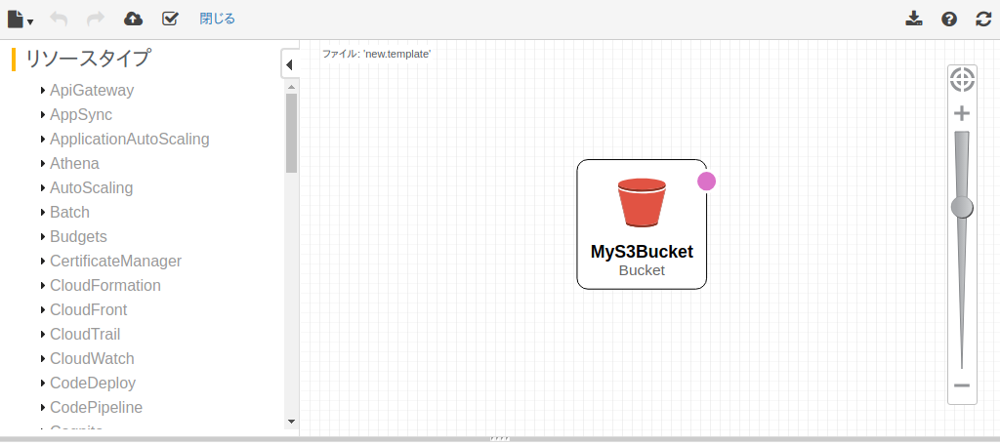

# AWS CloudFormationの使い方

AWS CloudFormationを利用するため、まず初めはスタックを作成するためのテンプレートを手に入れなけれる必要がある。テンプレートを入手する方法は大まかに3つだ。

1. AWSなどで公開されているサンプルテンプレートを使用する
2. クイックスタート（公式チュートリアル）で公開されているテンプレートを使用する
3. 自分でテンプレートを作成する
  - YAMLかJSON形式のテンプレートを作成する
  - CloudFormation Designerを利用する
  - CloudFormerを利用する

テンプレートを手に入れる方法は様々だが、まずはCloudFormationでスタックを作成することが目的のため、S3バケットを作成する最小のテンプレートを利用しよう。新規のテンプレートを作成するということで、 `CloudFormation Designer` も多少は利用する。

```json
{
  "AWSTemplateFormatVersion": "2010-09-09",
  "Resources": {
    "MyS3Bucket": {
      "Type": "AWS::S3::Bucket"
    }
  }
}
```

```yaml
AWSTemplateFormatVersion: 2010-09-09
Resources:
  MyS3Bucket:
    Type: AWS::S3::Bucket
```

`MyS3Bucket` 内に `"Properties": {"BucketName": ...` を含めることで作成するバケットの名前を指定することはできるが、ここでは指定せずAWSの自動生成に頼る。自動生成では `#{スタック名}-#{リソース名}-#{乱数}` の形式の名前が設定されるため、バケット名の重複がほとんどないためだ。

## スタックの作成

まず、CloudFormationのAWSマネジメントコンソールにある **スタックの作成** ボタンからスタック作成画面に移ろう。


スタックの作成画面では色々出てくるが、難しいことはない。 `テンプレートをデザインする` では、 `CloudFormation Designer` というツールを使って直感的に新規のテンプレートを作成することができる。 `テンプレートの選択` ではS3に保存したテンプレートファイルを指定してスタックを作成することができる。

S3に保存してあるテンプレートは無いので、ここでは **テンプレートのデザイン** ボタンから新規のテンプレートを作成するとしよう。


`CloudFormation Designer` はおなじみのAWSアイコンを繋げるだけでCloudFormationのテンプレートを作成できるというAWSのツールだ。（だが実際のところ、アイコンを繋げてテンプレートを作成することは、無い。）


このツールではアイコンを繋げてテンプレートを作るだけでなく、自分のテンプレートを記述できる機能もある。（こちらがメイン。）画面左下のタブ `テンプレート` をクリックすると、テキストエリアが自分のテンプレートを記述するためのテキストエリアに切り替わる。

`テンプレートの言語の選択` で選択されているのはJSONだが、今回はそこにYAMLのテンプレートを貼り付けてみよう。

```yaml
AWSTemplateFormatVersion: 2010-09-09
Resources:
  MyS3Bucket:
    Type: AWS::S3::Bucket
```


実は `テンプレートの言語の選択` がJSONでこのスペースにYAMLのテンプレートを貼り付けた場合、自動的にYAMLのラジオボタンが選択される。（つまり、この部分はあまり気にしなくても良い。）構文エラーのYAMLのテンプレートを貼り付けた場合は正常に切り替わらないので注意。

ここまで進むと、グラフ部分には `Designerが最新のものではないので、リフレッシュをクリックしてください。` という警告文が表示されるので、 **リフレッシュ** （右上の矢印が回っているマーク）をクリックしてグラフを更新しよう。



グラフには1つのS3バケットと思われるアイコンが出現する。太字で `MyS3Bucket` とリソース名が書かれているので、これはテンプレートで宣言したS3バケットで間違いない。

さて、これでCloudFormation Designerでの作業は終わりだ。新しいテンプレートの作成を確定するため、 **スタックの作成** （左上の雲に↑が書いてあるマーク）のボタンを押す。ここで作成されたテンプレートは、自分のアカウントの、CloudFormationによって自動生成されたS3バケットに保存される。

リダイレクトとローディングの後、画面はCloudFormation Designerを利用する前の、スタックの作成画面に戻される。


唯一違う点は、 `Amazon S3 テンプレートURLの指定` にURLが設定されていることだ。これはさっき作成したテンプレートファイルを指している。 **次へ** ボタンを押す。

`テンプレートの選択` の後は `詳細の指定` の画面に移る。ここではスタックの名前を設定するのだが、今回は `test-stack` としておこう。

名前を入力したら **次へ** ボタンを押す。


次は `オプション` を設定する画面に移る、が、設定しなければならない項目は無いので気にしなくても良い。

下までスクロールして **次へ** ボタンを押す。


最後は確認画面が表示される。今回はテンプレートを作成しただけなのと、スタックの名前を設定しただけなので意識するところはない。

問題がなければ **作成** ボタンを押す。


さて、これでスタックが作成される。作成したスタックは初めのAWSマネジメントコンソールで確認できる。スタックの作成が完了するまでには意外と時間がかかって、まずスタックの初期化、そしてAWSリソースの作成が始まる。

次の図は、スタック `test-stack` の作成が完了（ `CREATE_COMPLETE` ）した状態の図。画面下のタブ `イベント` では、スタックが `CREATE_IN_PROGRESS` から `CREATE_COMPLETE` に移り変わる様子が記録されている。


イベントタブの隣にあるタブ `リソース` からは、このテンプレートで作成したAWSリソースを参照することができる。 `物理 ID` 列のリンクからは実際にそのサービスに飛んで存在を確認することもできる。

以上で、**AWS CloudFormationの使い方** は終わりだ。ここで作成したS3バケットを削除したいときは、スタックを削除すれば良い。
