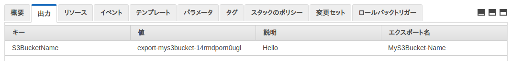

# 組み込み関数

さて、ここまででAWS CloudFormationを利用するまでの流れは一通り説明できたつもりだ。ここからは、CloudFormationのテンプレートをより柔軟にする、テンプレート内で使えるCloudFormationの組み込み関数を紹介する。

組み込み関数を使用することで、パラメーターやリソースの値を取得したり（ `Ref` ）、事前に定義したマップの値を抜き出したり（ `Fn::FindInMap` ）、値をBase64に変換したり（ `Fn::Base64` ）、別のスタックでエクスポートされた値を取得したり（ `Fn::ImportValue` ）、様々なことが出来るようになる。

次のリストは、CloudFormationに用意されている組み込み関数の全てだ。全てを利用することはほとんど無いが、どういう関数があるかを知っておくに越したことはない。条件関数を除く、全ての関数を簡単に説明していく。（条件関数は別記事）

- Ref
- Fn::GetAtt
- Fn::Join
- Fn::Sub
- Fn::ImportValue
- Fn::FindInMap
- Fn::Base64
- Fn::Select
- Fn::Split
- Fn::GetAZs
- Fn::Cidr
- 条件関数
  - Fn::If
  - Fn::Or
  - Fn::And
  - Fn::Equals
  - Fn::Not

## Ref

CloudFormationのテンプレートで一番よく見かけ、よく使う組み込み関数はこの **Ref** だ。Refは指定したParametersセクションの値、または指定したAWSリソースから決まった情報を取り出すことができる。

```json
{"Ref": "SampleResource"}
```

```yaml
Ref: SampleResource
```

YAMLの場合、Refに限らず関数は短縮形を利用できる。多くの場合、後尾の `:` を削除し、先頭に `!` を追加する。Refはあまり変わらないが、他の関数では書き方が大きく変わる場合もあるので、またその時に説明する。言わずもがな、よく利用されているのは短縮形のほうだ。

```yaml
!Ref SampleResource
```

RefでParametersセクションから値を取得するなら、設定された値を取り出すだけなので分かりやすい。しかしAWSリソースから値を取り出す場合、 `Type` キーによって取り出すことのできる値が変わるためややこしい。例えばTypeが `AWS::S3::Bucket` だった場合、Refで取得できるのは作成されたバケットの名前だ。

次のテンプレートでは引数で受け取った名前のS3バケットを生成し、スタックの出力としてそのバケットの名前を設定している。このように引数の値を取り出したり、AWSリソースの情報を取り出す際に、Refは使用されるのだ。

```json
{
  "AWSTemplateFormatVersion": "2010-09-09",
  "Parameters": {
    "BucketName": {
      "Type": "String",
      "Default": "param-my-s3-bucket",
      "Description": "It's a bucket name."
    }
  },
  "Resources": {
    "MyS3Bucket": {
      "Type": "AWS::S3::Bucket",
      "Properties": {
        "BucketName": {
          "Ref": "BucketName"
        }
      }
    }
  },
  "Outputs": {
    "S3BucketName": {
      "Description": "Hello",
      "Value": {
        "Ref": "MyS3Bucket"
      }
    }
  }
}
```

```yaml
AWSTemplateFormatVersion: 2010-09-09

Parameters:
  BucketName:
    Type: String
    Default: param-my-s3-bucket
    Description: It's a bucket name.

Resources:
  MyS3Bucket:
    Type: AWS::S3::Bucket
    Properties:
      BucketName: !Ref BucketName

Outputs:
  S3BucketName:
    Description: Hello
    Value: !Ref MyS3Bucket
```

どのTypeからどの値（名前やARN、何かのIDなど）が返されるかは推測が難しいため、実際にAWSリソースから値を取得する時は [Refのドキュメント](https://docs.aws.amazon.com/ja_jp/AWSCloudFormation/latest/UserGuide/intrinsic-function-reference-ref.html) の **リソースの戻り値の例** を見ながら進めるしかない。

# Fn::GetAtt

**Fn::GetAtt** はAWSリソースからRefで取り出せない値を取り出すための組み込み関数だ。Refについでよくテンプレート内で使用される。

RefはAWSリソースから決められた1つの値しか取れないため、他に欲しい値があったとしてもそれを取り出せない。そこで利用できるのが **Fn::GetAtt** だ。AWSリソースの名前と取得したい属性を指定することで、目的の値を取り出すことが出来る。

```json
{"Fn::GetAtt": ["SampleResource", "attributeName"]}
```

```yaml
Fn::GetAtt: ["SampleResource", "attributeName"]
```

YAML的な書き方として、こういう書き方も出来る。

```yaml
Fn::GetAtt:
  - SampleResource
  - attributeName
```

Fn::GetAttの短縮形は属性の指定が配列ではなくなり、メソッド的な呼び出し方を使用する。 `Fn::` 部分も省略できる短縮形はクールだが、Fn::GetAttは短縮しないパターン（完全形）の書き方もよく見かける。

```yaml
!GetAtt SampleResource.attributeName
```

参考までに、 `AWS::S3::Bucket` からRefで取り出せる値は `バケット名` だったが、Fn::GetAttでは `Arn` `DNS名` `IPv6 DNS名` `S3ウェブサイトURL` を取得できる。

次のテンプレートはS3バケットを作成し、スタックの出力としてバケットの `Arn` を設定したテンプレートである。ここでは短縮形を使用する。

```json
{
  "AWSTemplateFormatVersion": "2010-09-09",
  "Resources": {
    "MyS3Bucket": {
      "Type": "AWS::S3::Bucket"
    }
  },
  "Outputs": {
    "BucketArn": {
      "Value": {
        "Fn::GetAtt": ["MyS3Bucket", "Arn"]
      }
    }
  }
}
```

```yaml
AWSTemplateFormatVersion: 2010-09-09

Resources:
  MyS3Bucket:
    Type: AWS::S3::Bucket

Outputs:
  BucketArn:
    Value: !GetAtt MyS3Bucket.Arn
```

Refと同じように、Fn::GetAttで取り出せる値は `Type` によって事前に決まっている。 テンプレートを作成する時は [Fn::GetAttのドキュメント](https://docs.aws.amazon.com/ja_jp/AWSCloudFormation/latest/UserGuide/intrinsic-function-reference-ref.html) の **属性** を見ながら進めなければならない。

## Fn::Join

**Fn::Join** は区切り文字（文字列）を挟んで文字列配列を連結するための組み込み関数だ。プログラミング言語でもよく見かけるため、イメージし易いだろう。

関数に区切り文字と連結させたい文字列配列を含んだ配列を渡すことで、文字列配列の要素が区切り文字で連結された値が返される。

```json
{"Fn::Join": ["-", ["Hello", "AWS", "CloudFormation"]]}
```

```yaml
Fn::Join: ["-", ["Hello", "AWS", "CloudFormation"]]
```

YAML的な書き方として、こういう書き方も出来る。

```yaml
Fn::Join:
  - '-'
  - - Hello
    - AWS
    - CloudFormation
```

この結果はどれも `Hello-AWS-CloudFormation` だ。Fn::Joinの短縮形はRefと同じようにほとんど変わらない。Fn::GetAttと同じように `Fn::` を持つ組み込み関数なので、短縮形ではこれを省略できる。

```yaml
!Join ["-", ["Hello", "AWS", "CloudFormation"]]
```

次のテンプレートでは、擬似パラメーター `AWS::AccountId` からRefで取得したアカウントIDをもともと設定してある文字列 `bucket` と `-` で連結させるテンプレートだ。アカウントで重複しないアカウントIDは、名前の重複が許されないS3バケットの名付けに便利でよく利用される。

```json
{
  "AWSTemplateFormatVersion": "2010-09-09",
  "Resources": {
    "MyS3Bucket": {
      "Type": "AWS::S3::Bucket",
      "Properties": {
        "BucketName": {
          "Fn::Join": ["-", [{"Ref": "AWS::AccountId"}, "bucket"]]
        }
      }
    }
  }
}
```

```yaml
AWSTemplateFormatVersion: 2010-09-09

Resources:
  MyS3Bucket:
    Type: AWS::S3::Bucket
    Properties:
      BucketName: !Join ["-", [!Ref AWS::AccountId, "bucket"]]
```

## Fn::Sub

**Fn::Sub** は文字列内の特定の文字列を指定した値に置き換えることができる組み込み関数だ。

この関数には2つの使い方があり、ひとつ目は `${name}` のように `${ }` で囲んだ文字列を含んだ文字列とハッシュ型の変数マップの要素を持った配列を渡すパターン。ふたつ目は、最初の文字列だけを渡し、ハッシュ型の変数マップは渡さないパターンだ。

ひとつ目の使い方は、C言語で言うprintfのようなものだと考えて良い。単純に文字列を置き換えてくれる。

```json
{"Fn::Sub": [
  "Hello ${name1} and ${name2}",
  {
    "name1": "World",
    "name2":  "AWS"
  }
]}
```

```yaml
Fn::Sub:
  - Hello ${name1} and ${name2}
  - name1: World
    name2: AWS
```

短縮形はRefと同じであまり変わらない。

```yaml
!Sub
  - Hello ${name1} and ${name2}
  - name1: World
    name2: AWS
```

この結果はどちらも `Hello World and AWS` となる。使い方にもよるが、簡単なFn::Joinなら置き換えることもできるので場面に合った使い方で記述する。

ふたつ目の使い方は、前述したテンプレートの最初の文字列だけ渡す方法だ。文字列だけを渡すと、 `${ }` で囲われた文字列は組み込み関数 `Ref` をかけた形に変換される。囲う文字列をメソッド指定のような形にすることで、組み込み関数 `Fn::GetAtt` をかけた形にも変換することができる。この形のFn::Subはある意味、 `Ref` `Fn::GetAtt` `Fn::Join` をひとつにしたようなものだ。

```json
{"Fn::Sub": "My bucket is ${SampleResource}"}
```

```yaml
Fn::Sub: My bucket is ${SampleResource}
```

短縮形はあまり変わらない。しかし、テンプレートで見かけるものはほとんどがこの状態（短縮形、文字列のみ）のFn::Subだ。

```yaml
!Sub My bucket is ${SampleResource}
```

次のテンプレートはS3バケットを作成し、Outputsセクションでバケットの名前とバケットのARNを出力するテンプレートだ。バケットの名前ではハッシュを渡す形のFn::Sub、ARNでは文字列のみ渡す形のFn::Subを使用している。

```json
{
  "AWSTemplateFormatVersion": "2010-09-09",
  "Resources": {
    "MyS3Bucket": {
      "Type": "AWS::S3::Bucket"
    }
  },
  "Outputs": {
    "BucketName": {
      "Value": {
        "Fn::Sub": [
          "${BucketName}",
          {"BucketName": {"Ref": "MyS3Bucket"}}
        ]
      }
    },
    "BucketArn": {
      "Value": {"Fn::Sub": "${MyS3Bucket.Arn}"}
    }
  }
}
```

```yaml
AWSTemplateFormatVersion: 2010-09-09

Resources:
  MyS3Bucket:
    Type: AWS::S3::Bucket

Outputs:
  BucketName:
    Value: !Sub
      - ${BucketName}
      - BucketName: !Ref MyS3Bucket

  BucketArn:
    Value: !Sub ${MyS3Bucket.Arn}
```

文字列のみを渡したFn::Subは擬似パラメーターの値を取り出すことも出来る。

```json
{"Fn::Sub": "${AWS::AccountId}"}
```

```yaml
Fn::Sub: ${AWS::AccountId}
```

## Fn::ImportValue

**Fn::ImportValue** は別のスタックがエクスポート（Outputsセクション）した値を取得するための組み込み関数だ。所謂 **クロススタック参照** と呼ばれるもので、長くなりすぎたテンプレートを分割する際などに利用できる。

Fn::ImportValueを利用するならまず、別のスタックのOutputsセクションで値をエクスポートしなければならない。エクスポートにはそのリージョンで一意な名前を `Export` キーに付与してやる必要がある。

次のテンプレートは作成したS3バケットの名前を `MyS3Bucket-Name` というエクスポート名でエクスポートするスタックのテンプレートだ。

```json
{
  "AWSTemplateFormatVersion": "2010-09-09",
  "Resources": {
    "MyS3Bucket": {
      "Type": "AWS::S3::Bucket"
    }
  },
  "Outputs": {
    "S3BucketName": {
      "Description": "Hello",
      "Value": {"Ref": "MyS3Bucket"},
      "Export": {"Name": "MyS3Bucket-Name"}
    }
  }
}
```

```yaml
AWSTemplateFormatVersion: 2010-09-09

Resources:
  MyS3Bucket:
    Type: 'AWS::S3::Bucket'

Outputs:
  S3BucketName:
    Description: Hello
    Value: !Ref MyS3Bucket
    Export:
      Name: MyS3Bucket-Name
```

これで、`MyS3Bucket-Name` という名前でS3のバケットをエクスポートしたスタックが生まれた。




## Fn::FindInMap

**Fn::FindInMap** はMappingsセクションで宣言されたマッピングから値を取り出すための組み込み関数だ。

```json
{"Fn::FindInMap" : ["SampleMap", "FirstKey", "SecondKey"]}
```

```yaml
Fn::FindInMap: ["SampleMap", "FirstKey", "SecondKey"]
```

短縮形はほとんど変わらない。同じようにキーを指定することで、値を取り出すことができる。

```yaml
!FindInMap ["SampleMap", "FirstKey", "SecondKey"]
```

次のテンプレートはMappingsセクションで宣言されたマッピング `RegionMap` を利用して、S3バケットの名前をリージョンによって変えるテンプレートだ。FirstKeyにはParamettersセクションから受け取った値か、よく擬似パラメーター（今回では `AWS::Region` ）が利用される。

```json
{
  "AWSTemplateFormatVersion": "2010-09-09",
  "Mappings" : {
    "RegionMap" : {
      "us-east-1" : { "S3" : "us-east-1-bucket"},
      "us-west-1" : { "S3" : "us-west-1-bucket"}
    }
  },
  "Resources": {
    "MyS3Bucket": {
      "Type": "AWS::S3::Bucket",
      "Properties": {
        "BucketName": {
          "Fn::FindInMap": ["RegionMap", {"Ref": "AWS::Region"}, "S3"]
        }
      }
    }
  }
}
```

```yaml
AWSTemplateFormatVersion: 2010-09-09

Mappings:
  RegionMap:
    us-east-1:
      S3: us-east-1-bucket
    us-west-1:
      S3: us-west-1-bucket

Resources:
  MyS3Bucket:
    Type: AWS::S3::Bucket
    Properties:
      BucketName: !FindInMap ["RegionMap", !Ref AWS::Region, "S3"]
```

## Fn::Base64

**Fn::Base64** は渡された文字列をBase64に変換する関数だ。

```json
{"Fn::Base64": "AWS CloudFormation"}
```

```yaml
Fn::Base64: AWS CloudFormation
```

短縮形はほとんど変わらない。

```yaml
!Base64 AWS CloudFormation
```

ちなみに、この結果は `QVdTIENsb3VkRm9ybWF0aW9u` となる。

## Fn::Select

**Fn::Select** はリストから値を抜き出す関数だ。インデックスとリストを含む配列を渡すことで、目的の値を得ることができる。

```json
{"Fn::Select": ["1", ["Hello", "AWS", "CloudFormation"]]}
```

```yaml
Fn::Select: ["1", ["Hello", "AWS", "CloudFormation"]]
```

この結果はどちらも `AWS` だ。短縮形もあまり変わらない形で使用できる。

```yaml
!Select ["1", ["Hello", "AWS", "CloudFormation"]]
```

ここに例のテンプレートは記述しないが、この後に説明する3つの関数 `Fn::Split` `Fn::GetAZs` `Fn::Cidr` は配列を返す組み込み関数のため、Fn::Selectとの併用が可能だ。

## Fn::Split
## Fn::GetAZs
## Fn::Cidr

## 参考

- [組み込み関数リファレンス - AWS CloudFormation](https://docs.aws.amazon.com/ja_jp/AWSCloudFormation/latest/UserGuide/intrinsic-function-reference.html)
