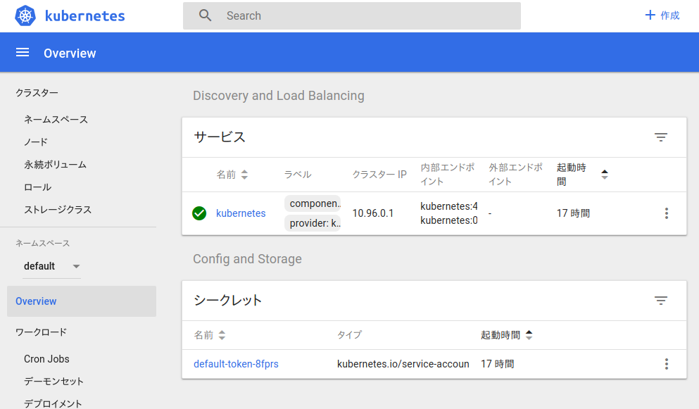

# minikube

## 概要

MinikubeはKubernetesをローカルで簡単に実行できるツールのことで、Kubernetesをちょっと触ってみたいとか練習時はこれが有用だ。詳しくは[公式リポジトリ](https://github.com/kubernetes/minikube)参照。

Minikubeのチュートリアルなんてもう山ほど転がっていると思うが、ここではできるだけ分かりやすくMinikubeのセットアップを解説する。


## インストール

[Install Minikube](https://kubernetes.io/docs/tasks/tools/install-minikube/)に沿って説明する。ここでは `ハイパーバイザ` 、 `kubectl` 、 `Minikube` の3つをインストールすることになる。

ハイパーバイザと言うと難しそうに聞こえるが、これは `VirtualBox` や `VMWare` など仮想マシンを動かすための環境のことだ。Minikubeは指定したハイパーバイザの仮想マシン上で動作するのでホスト環境のDockerコンテナなどを汚さないようになっている。（ハイパーバイザを使用しない場合はその限りではない）

また、kubectlはKubernetesのコマンドラインツールのことだ。Kubernetesを操作・管理するために必要になる。

#### 1. ハイパーバイザのインストール

Minikubeには標準で `VirtualBox` と `VMWare` を扱う仕組みが備わっているので基本的にはこのどちらかを利用する。よく使われるのは `VirtualBox` のほう。

- [Install a Hypervisor](https://kubernetes.io/docs/tasks/tools/install-minikube/#install-a-hypervisor)

#### 2. kubectlのインストール

今回はハイパーバイザ上で動作するMinikubeを操作するために利用される。

- [Install and Set Up kubectl](https://kubernetes.io/docs/tasks/tools/install-kubectl/)

#### 3. Minikubeのインストール

Minikube本体のインストールは公式のリリースノートが丁寧で、各OSごとにやり方が用意されている。これを見ながらやったらたぶん、なんとかなる。

- [kubernetes/minikube/releases](https://github.com/kubernetes/minikube/releases)

インストールが完了したなら、 `minikube version` などで存在を確認できる。

```
$ minikube version
minikube version: v0.28.2
```


## 起動と接続

ハイパーバイザ、kubectl、Minikubeをインストールしたならば、まずは起動してみる。

minikubeはDocker公式のオーケストレーションツールであるDocker Machineを使ってVM上にKubernetes環境を作成するので、どのハイパーバイザ上に立ち上げるかを指定する。ここではVirtualBoxを利用することにする。

> ドライバーについての記載は[この記事](https://github.com/kubernetes/minikube/blob/master/docs/drivers.md)

Minikubeの起動には `minikube start` を使う。 `--vm-driver` のオプションでドライバ（使用するハイパーバイザ）を指定できる。 `--vm-driver=none` を使うとVMではなくホスト上でminikubeを立ち上げられる。

```
$ minikube --vm-driver=virtualbox start
Starting local Kubernetes v1.10.0 cluster...
Starting VM...
Getting VM IP address...
Moving files into cluster...
Setting up certs...
Connecting to cluster...
Setting up kubeconfig...
Starting cluster components...
Kubectl is now configured to use the cluster.
Loading cached images from config file.
```

コマンドを入力したなら、こんな表示を出してminikubeが起動する。

今後もそうだがもしこのようなエラーが出たら、  `minikube delete` で解決するかもしれない。deleteしたあとは再度 `minikube start` を実行する。

```
Error restarting cluster:  restarting kube-proxy: waiting for kube-proxy to be up for configmap update: timed out waiting for the condition

$ minikube delete
$ minikube --vm-driver=virtualbox start
```

minikubeが起動出来ていそうなら `minikube status` でIPアドレス等を確認することができる。 `kubectl cluster-info` を使うことでkubectl側から起動しているクラスターの情報を見ることも可能。

```
$ minikube status
minikube: Running
cluster: Running
kubectl: Correctly Configured: pointing to minikube-vm at 192.168.99.100

$ kubectl cluster-info
Kubernetes master is running at https://192.168.99.100:8443
KubeDNS is running at https://192.168.99.100:8443/api/v1/namespaces/kube-system/services/kube-dns:dns/proxy
```

### kubectlの接続

クラスターを起動すると、コマンドラインツール `kubectl` の向き先は自動的にminikubeのほうを向くようになっている。このため特に設定しなくても、kubectlからminikubeのクラスターを操作することが出来る。

だた、もし自動的に設定されていなかった場合は自分でコンテキスト（操作するクラスター）を切り替えることで対応しよう。minikubeは本来自動でこの切り替えをやってくれる。

コンテキストの一覧は `kubectl config get-contexts` で確認でき、 `kubectl config use-context` で名前を指定するとそのコンテキストを利用できる。（minikubeのコンテキスト名は `minikube` ）

```
$ kubectl config get-contexts
CURRENT   NAME       CLUSTER    AUTHINFO   NAMESPACE
*         minikube   minikube   minikube

$ kubectl config use-context minikube
Switched to context "minikube".
```

これらコンテキストの情報は `~/.kube/config` に格納されているのだが、kubectlの範囲なのでここではこれ以上は触れない。


### ダッシュボード

これが完了したら一旦の接続確認は完了。

Minikubeを起動すると自動的に[Kubernetes Dashboard](https://github.com/kubernetes/dashboard)が立ち上がるようになっており、ここには指定URLからアクセスできる。このダッシュボードはクラスタのCPUやメモリーの状態、起動しているコンテナなどリソースの情報を表示していて、うまく動いているかの確認の役に立つ。（Minukubeだとクラスタといっても、VMが1つあるだけだが…）

アクセスするには `minikube dashboard` でブラウザを立ち上げてもらうか、 `--url` オプションで表示されたURLに手動でアクセスする方法がある。

```
$ minikube dashboard --url
http://192.168.99.100:30000
```

こんな画面が表示される。




## コンテナの確認

ここまで動作させて気になるのが `クラスター > ノード > minikube` のタブで見ることができるポッド（コンテナの集合体）がどのようにして動かされているのかだ。ホストで `docker ps` を実行してもMinikubeが動いているのはVM上のため実際にコンテナを確認することは出来ない。

こんなに時は、Minikubeが動いているVMのDockerデーモン（コマンド）を利用できるコマンド `eval $(minikube docker-env)` が役に立つ。既存のDockerコマンドの設定を書き換え、VM内のDockerの出力結果を得られる、というものだ。（元に戻すときは `-u` オプション）

```
$ eval $(minikube docker-env)
$ eval $(minikube docker-env -u)
```

`docker ps` の結果では複数のコンテナが起動していて、 `kube-apiserver` 、 `kube-controller-manager` 、 `kube-scheduler` が動いているのでこのノードがマスターノードであることが確認できる。（見難いけど、 `docker ps` のIMAGEかNAMESで確認可能）

```
$ docker ps --format '{{.Image}}\t{{.Names}}'
k8s.gcr.io/k8s-dns-sidecar-amd64	k8s_sidecar_kube-dns-86f4d74b45-8dq2v_kube-system_bdd19471-fd1e-11e8-9fce-08002750ed9b_0
k8s.gcr.io/heapster-grafana-amd64	k8s_grafana_influxdb-grafana-krrwn_kube-system_bee37f27-fd1e-11e8-9fce-08002750ed9b_0
k8s.gcr.io/k8s-dns-dnsmasq-nanny-amd64	k8s_dnsmasq_kube-dns-86f4d74b45-8dq2v_kube-system_bdd19471-fd1e-11e8-9fce-08002750ed9b_0
gcr.io/k8s-minikube/storage-provisioner	k8s_storage-provisioner_storage-provisioner_kube-system_bf86b588-fd1e-11e8-9fce-08002750ed9b_0
k8s.gcr.io/heapster-amd64	k8s_heapster_heapster-wpbbh_kube-system_bedb7500-fd1e-11e8-9fce-08002750ed9b_0
k8s.gcr.io/heapster-influxdb-amd64	k8s_influxdb_influxdb-grafana-krrwn_kube-system_bee37f27-fd1e-11e8-9fce-08002750ed9b_0
k8s.gcr.io/kubernetes-dashboard-amd64	k8s_kubernetes-dashboard_kubernetes-dashboard-5498ccf677-jv5ll_kube-system_bed158ed-fd1e-11e8-9fce-08002750ed9b_0
k8s.gcr.io/kube-proxy-amd64	k8s_kube-proxy_kube-proxy-7shh2_kube-system_bdcc5b4c-fd1e-11e8-9fce-08002750ed9b_0
k8s.gcr.io/k8s-dns-kube-dns-amd64	k8s_kubedns_kube-dns-86f4d74b45-8dq2v_kube-system_bdd19471-fd1e-11e8-9fce-08002750ed9b_0
k8s.gcr.io/pause-amd64:3.1	k8s_POD_storage-provisioner_kube-system_bf86b588-fd1e-11e8-9fce-08002750ed9b_0
k8s.gcr.io/pause-amd64:3.1	k8s_POD_heapster-wpbbh_kube-system_bedb7500-fd1e-11e8-9fce-08002750ed9b_0
k8s.gcr.io/pause-amd64:3.1	k8s_POD_influxdb-grafana-krrwn_kube-system_bee37f27-fd1e-11e8-9fce-08002750ed9b_0
k8s.gcr.io/pause-amd64:3.1	k8s_POD_kubernetes-dashboard-5498ccf677-jv5ll_kube-system_bed158ed-fd1e-11e8-9fce-08002750ed9b_0
k8s.gcr.io/pause-amd64:3.1	k8s_POD_kube-proxy-7shh2_kube-system_bdcc5b4c-fd1e-11e8-9fce-08002750ed9b_0
k8s.gcr.io/pause-amd64:3.1	k8s_POD_kube-dns-86f4d74b45-8dq2v_kube-system_bdd19471-fd1e-11e8-9fce-08002750ed9b_0
k8s.gcr.io/kube-scheduler-amd64	k8s_kube-scheduler_kube-scheduler-minikube_kube-system_2acb197d598c4730e3f5b159b241a81b_0
k8s.gcr.io/kube-apiserver-amd64	k8s_kube-apiserver_kube-apiserver-minikube_kube-system_85bc41416e6cd3f7d13a656ca8a2c4e0_0
k8s.gcr.io/kube-controller-manager-amd64	k8s_kube-controller-manager_kube-controller-manager-minikube_kube-system_c76db6c34089cf20cc4b22225818b39a_0
k8s.gcr.io/kube-addon-manager	k8s_kube-addon-manager_kube-addon-manager-minikube_kube-system_3afaf06535cc3b85be93c31632b765da_0
k8s.gcr.io/etcd-amd64	k8s_etcd_etcd-minikube_kube-system_8cd2374a5c501ee7cfa128d8934ec393_0
k8s.gcr.io/pause-amd64:3.1	k8s_POD_kube-controller-manager-minikube_kube-system_c76db6c34089cf20cc4b22225818b39a_0
k8s.gcr.io/pause-amd64:3.1	k8s_POD_kube-apiserver-minikube_kube-system_85bc41416e6cd3f7d13a656ca8a2c4e0_0
k8s.gcr.io/pause-amd64:3.1	k8s_POD_kube-addon-manager-minikube_kube-system_3afaf06535cc3b85be93c31632b765da_0
k8s.gcr.io/pause-amd64:3.1	k8s_POD_etcd-minikube_kube-system_8cd2374a5c501ee7cfa128d8934ec393_0
k8s.gcr.io/pause-amd64:3.1	k8s_POD_kube-scheduler-minikube_kube-system_2acb197d598c4730e3f5b159b241a81b_0
```


## 停止と削除

Minikube環境を削除するときは `minikube stop` 、 `minikube delete` を使用する。

```
$ minikube stop
Stopping local Kubernetes cluster...
Machine stopped.

$ minikube delete
```

## 参考

- [公式のドキュメント](https://github.com/kubernetes/minikube/tree/master/docs)
