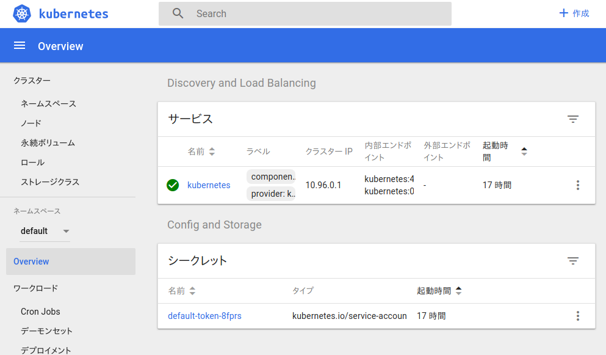

# Minikube setup

## 概要

MinikubeはKubernetesをローカルで簡単に実行できるツールで、Kubernetesをちょっと触ってみたい、練習してみたい、または1ノードで実行したいとか考えている時これが有用だ。

- [公式リポジトリ](https://github.com/kubernetes/minikube)

Minikubeのチュートリアルなんてもう山ほど転がっていると思うが、ここでもMinikubeのセットアップの順序だけ解説してみる。

## インストール

[Install Minikube](https://kubernetes.io/docs/tasks/tools/install-minikube/) に沿って説明する。この内容に従って、 `ハイパーバイザ` 、 `kubectl` 、 `Minikube` の3つをインストールしよう。

ハイパーバイザは `VirtualBox` や `VMWare` など仮想マシンを動かすための環境のことだ。Minikubeは指定したハイパーバイザの仮想マシン上で動作するので、ホスト環境を汚さずに実行することができる。（ハイパーバイザを使用しない場合はその限りではない）

kubectlはKubernetesのコマンドラインツールのことで、Kubernetesをコマンドで操作・管理するために必要。

#### 1. ハイパーバイザのインストール

Minikubeには標準で `VirtualBox` と `VMWare` を扱う仕組みが備わっているので基本的にはこのどちらかを利用する。Vagrantとかでもそうだけど、よく使われるのは `VirtualBox` のほう。

- [Install a Hypervisor](https://kubernetes.io/docs/tasks/tools/install-minikube/#install-a-hypervisor)

#### 2. kubectlのインストール

Minikubeで動くKubernetesを操作するためにインストールする。コマンドの設定ファイルは `~/.kube` に入る。

- [Install and Set Up kubectl](https://kubernetes.io/docs/tasks/tools/install-kubectl/)

#### 3. Minikubeのインストール

Minikube本体のインストールは公式のリリースノートが丁寧で、各OSごとにやり方が用意されている。。

- [kubernetes/minikube/releases](https://github.com/kubernetes/minikube/releases)

インストールが完了したら、 `minikube version` などで存在を確認できる。

```
$ minikube version
minikube version: v0.28.2
```

## 起動と接続

インストールが完了したなら、Minikubeを起動してみよう。

MinikubeはDocker公式のオーケストレーションツールである `Docker Machine` を使って指定の環境にKubernetes環境を作成する。ここではさっきインストールしたVirtualBoxを使用する。

> ドライバーについての記載は[この記事](https://github.com/kubernetes/minikube/blob/master/docs/drivers.md)

Minikubeの起動には `minikube start` を使う。その時、 `--vm-driver` のオプションでドライバ（使用するハイパーバイザ）を指定する。（ `--vm-driver=none` を使うとホスト上でMinikubeを立ち上げられる）

```
$ minikube --vm-driver=virtualbox start
Starting local Kubernetes v1.10.0 cluster...
Starting VM...
Getting VM IP address...
Moving files into cluster...
Setting up certs...
Connecting to cluster...
Setting up kubeconfig...
Starting cluster components...
Kubectl is now configured to use the cluster.
Loading cached images from config file.
```

スタートしたら、こんな表示を出してMinikubeが起動する。

もし次のようなエラーが出たら `minikube delete` と `minikube start` でMinikubeを再生成することで解決するかもしれない。力押しだが、この方法は今後も恐らく役に立つ。

```
Error restarting cluster:  restarting kube-proxy: waiting for kube-proxy to be up for configmap update: timed out waiting for the condition

$ minikube delete
$ minikube --vm-driver=virtualbox start
```

Minikubeが起動したら、まずは `minikube status` でIPアドレス等を確認してみよう。kubectl側からも `kubectl cluster-info` で起動しているクラスターの情報を見ることができる。

```
$ minikube status
minikube: Running
cluster: Running
kubectl: Correctly Configured: pointing to minikube-vm at 192.168.99.100

$ kubectl cluster-info
Kubernetes master is running at https://192.168.99.100:8443
KubeDNS is running at https://192.168.99.100:8443/api/v1/namespaces/kube-system/services/kube-dns:dns/proxy
```

### kubectlの接続

クラスターを起動するとコマンドラインツール `kubectl` は自動的にMinikubeの環境を操作するようになる。そのため、特に設定しなくてもkubectlからminikubeのクラスターを操作することが出来る。

だた、もし自動的に設定されていなかった場合は自分でコンテキスト（操作するクラスター）を切り替えることで対応しよう。Minikubeは本来自動でこの切り替えまでも勝手にやってくれる。

コンテキストの一覧は `kubectl config get-contexts` で確認でき、 `kubectl config use-context [name]` のように利用するコンテキストを選択できる。（minikubeのコンテキスト名は `minikube` ）

```
$ kubectl config get-contexts
CURRENT   NAME       CLUSTER    AUTHINFO   NAMESPACE
*         minikube   minikube   minikube

$ kubectl config use-context minikube
Switched to context "minikube".
```

これらコンテキストの情報は `~/.kube/config` に格納されている。

### ダッシュボード

ここまで完了したら一旦の接続確認は完了。

Kubernetesには[Kubernetes Dashboard](https://github.com/kubernetes/dashboard)というクラスタのCPUやメモリーの状態、起動しているコンテナなどリソースの情報を表示するダッシュボードというアプリが備わっており、Minikubeを起動した際にこれが自動的立ち上がるようになっている。

ここには指定URLからアクセスでき、Kubernetesがうまく動いているかの確認の役に立つ。

アクセスするには `minikube dashboard` でブラウザを立ち上げてもらうか、`--url` オプションで表示されたURLに手動でアクセスする方法がある。

```
$ minikube dashboard --url
http://192.168.99.100:30000
```

正常に動作しているなら、アクセスした時にこんな画面が表示される。




## コンテナの確認

ここまで動作させて気になるのが `クラスター > ノード > minikube` のタブで見ることができるポッド（Dockerコンテナの集合体）がどのようにして動かされているのかだ。ホストで `docker ps` を実行してもMinikubeが動いているのはVM上のため実際にコンテナを確認することは出来ない。

```
$ docker ps
CONTAINER ID  IMAGE  COMMAND  CREATED  STATUS  PORTS  NAMES
```

こんなに時は、Minikubeが動いているVMのDockerデーモンのコマンドを利用できる `eval $(minikube docker-env)` が役に立つ。既存のDockerコマンドの設定を書き換え、VM内のDockerの出力結果を得られる。（元に戻すときは `-u` オプション）

```
$ eval $(minikube docker-env)
$ eval $(minikube docker-env -u)
```

`docker ps` の結果では複数のコンテナが起動していて、 `kube-apiserver` 、 `kube-controller-manager` 、 `kube-scheduler` が動いているのでこのノードがマスターノードであることが確認できる。（見難いけど、 `docker ps` のIMAGEかNAMESで確認可能）

```
$ docker ps --format '{{.Image}}\t{{.Names}}'
k8s.gcr.io/k8s-dns-sidecar-amd64	k8s_sidecar_kube-dns-86f4d74b45-8dq2v_kube-system_bdd19471-fd1e-11e8-9fce-08002750ed9b_0
k8s.gcr.io/heapster-grafana-amd64	k8s_grafana_influxdb-grafana-krrwn_kube-system_bee37f27-fd1e-11e8-9fce-08002750ed9b_0
k8s.gcr.io/k8s-dns-dnsmasq-nanny-amd64	k8s_dnsmasq_kube-dns-86f4d74b45-8dq2v_kube-system_bdd19471-fd1e-11e8-9fce-08002750ed9b_0
gcr.io/k8s-minikube/storage-provisioner	k8s_storage-provisioner_storage-provisioner_kube-system_bf86b588-fd1e-11e8-9fce-08002750ed9b_0
k8s.gcr.io/heapster-amd64	k8s_heapster_heapster-wpbbh_kube-system_bedb7500-fd1e-11e8-9fce-08002750ed9b_0
k8s.gcr.io/heapster-influxdb-amd64	k8s_influxdb_influxdb-grafana-krrwn_kube-system_bee37f27-fd1e-11e8-9fce-08002750ed9b_0
k8s.gcr.io/kubernetes-dashboard-amd64	k8s_kubernetes-dashboard_kubernetes-dashboard-5498ccf677-jv5ll_kube-system_bed158ed-fd1e-11e8-9fce-08002750ed9b_0
k8s.gcr.io/kube-proxy-amd64	k8s_kube-proxy_kube-proxy-7shh2_kube-system_bdcc5b4c-fd1e-11e8-9fce-08002750ed9b_0
k8s.gcr.io/k8s-dns-kube-dns-amd64	k8s_kubedns_kube-dns-86f4d74b45-8dq2v_kube-system_bdd19471-fd1e-11e8-9fce-08002750ed9b_0
k8s.gcr.io/pause-amd64:3.1	k8s_POD_storage-provisioner_kube-system_bf86b588-fd1e-11e8-9fce-08002750ed9b_0
k8s.gcr.io/pause-amd64:3.1	k8s_POD_heapster-wpbbh_kube-system_bedb7500-fd1e-11e8-9fce-08002750ed9b_0
k8s.gcr.io/pause-amd64:3.1	k8s_POD_influxdb-grafana-krrwn_kube-system_bee37f27-fd1e-11e8-9fce-08002750ed9b_0
k8s.gcr.io/pause-amd64:3.1	k8s_POD_kubernetes-dashboard-5498ccf677-jv5ll_kube-system_bed158ed-fd1e-11e8-9fce-08002750ed9b_0
k8s.gcr.io/pause-amd64:3.1	k8s_POD_kube-proxy-7shh2_kube-system_bdcc5b4c-fd1e-11e8-9fce-08002750ed9b_0
k8s.gcr.io/pause-amd64:3.1	k8s_POD_kube-dns-86f4d74b45-8dq2v_kube-system_bdd19471-fd1e-11e8-9fce-08002750ed9b_0
k8s.gcr.io/kube-scheduler-amd64	k8s_kube-scheduler_kube-scheduler-minikube_kube-system_2acb197d598c4730e3f5b159b241a81b_0
k8s.gcr.io/kube-apiserver-amd64	k8s_kube-apiserver_kube-apiserver-minikube_kube-system_85bc41416e6cd3f7d13a656ca8a2c4e0_0
k8s.gcr.io/kube-controller-manager-amd64	k8s_kube-controller-manager_kube-controller-manager-minikube_kube-system_c76db6c34089cf20cc4b22225818b39a_0
k8s.gcr.io/kube-addon-manager	k8s_kube-addon-manager_kube-addon-manager-minikube_kube-system_3afaf06535cc3b85be93c31632b765da_0
k8s.gcr.io/etcd-amd64	k8s_etcd_etcd-minikube_kube-system_8cd2374a5c501ee7cfa128d8934ec393_0
k8s.gcr.io/pause-amd64:3.1	k8s_POD_kube-controller-manager-minikube_kube-system_c76db6c34089cf20cc4b22225818b39a_0
k8s.gcr.io/pause-amd64:3.1	k8s_POD_kube-apiserver-minikube_kube-system_85bc41416e6cd3f7d13a656ca8a2c4e0_0
k8s.gcr.io/pause-amd64:3.1	k8s_POD_kube-addon-manager-minikube_kube-system_3afaf06535cc3b85be93c31632b765da_0
k8s.gcr.io/pause-amd64:3.1	k8s_POD_etcd-minikube_kube-system_8cd2374a5c501ee7cfa128d8934ec393_0
k8s.gcr.io/pause-amd64:3.1	k8s_POD_kube-scheduler-minikube_kube-system_2acb197d598c4730e3f5b159b241a81b_0
```

## 情報の閲覧

クラスタイベントは `kubectl get event` 、kubectlの設定は `kubectl config view` で見ることが出来る。

```
$ kubectl get events
$ kubectl config view
```

## 停止と削除

Minikube環境を削除するときは `minikube stop` -> `minikube delete` を使用する。

```
$ minikube stop
Stopping local Kubernetes cluster...
Machine stopped.

$ minikube delete
```

## 参考

- [公式のドキュメント](https://github.com/kubernetes/minikube/tree/master/docs)
